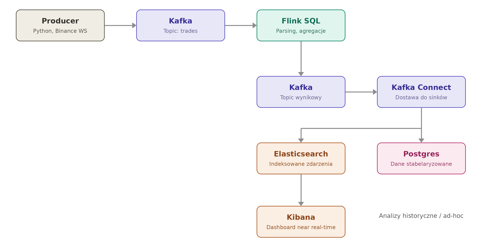

# CryptoStream

## Problem, który projekt rozwiązuje

Traderzy kryptowalut potrzebują wglądu w rynek na żywo, żeby szybko reagować na zmiany ceny i wolumenu.
Surowy strumień transakcji z giełdy jest trudny do analizy "gołym okiem" — trzeba go agregować,
liczyć w oknach czasowych i wizualizować, żeby dało się z niego wyciągnąć sensowne wnioski.

Projekt buduje pipeline, który:
- odbiera transakcje z giełdy kryptowalut w czasie rzeczywistym,
- przetwarza je (agregacje, okna czasowe) w locie,
- udostępnia wynik w dwóch formach: dashboard near real-time (do monitorowania na żywo)
  oraz trwałe, ustrukturyzowane dane (do analiz historycznych i zapytań ad-hoc).

## Zakres na start (MVP)

- Jeden symbol: **BTC/USDT**
- Jeden typ zdarzenia: pojedyncza transakcja (`trade` stream)
- Cel: przejście całego pipeline'u end-to-end, zanim dojdzie się do rozszerzeń

## Architektura

Przepływ danych:

1. **Producer (Python)** — łączy się do Binance WebSocket, odbiera surowe zdarzenia `trade`,
   wysyła je na topic Kafki.
2. **Kafka** — bufor/broker, topic `trades`, oddziela producenta od dalszego przetwarzania.
3. **Flink SQL** — konsumuje z Kafki, parsuje i tabelaryzuje surowy JSON (rzutowanie typów,
   ewentualne agregacje w oknach czasowych), a wynik zapisuje z powrotem na wyjściowy topic Kafki.
4. **Kafka Connect** — odbiera z wyjściowego topicu i dostarcza dane do dwóch miejsc (fan-out
   po stronie dostawy, nie przetwarzania):
   - **Elasticsearch → Kibana** — dane trafiają do Elasticsearch, Kibana buduje na tym
     dashboard near real-time do monitorowania rynku na żywo.
   - **Postgres** — dane stabelaryzowane trafiają do trwałego, relacyjnego magazynu,
     do analiz historycznych i zapytań ad-hoc.

Całość uruchomiona w Docker Compose — każdy komponent (Kafka, Flink, Kafka Connect,
Elasticsearch, Kibana, Postgres) jako osobny kontener w jednej sieci.

## Źródło danych

**Binance WebSocket API** — publiczny, darmowy strumień danych rynkowych, bez klucza API i bez logowania.

- Dokumentacja: https://developers.binance.com/docs/binance-spot-api-docs/web-socket-streams

### Struktura pojedynczej wiadomości (`trade` stream)

| Pole | Znaczenie | Przykład |
|------|-----------|----------|
| `e`  | typ zdarzenia | `"trade"` |
| `E`  | czas wysłania wiadomości (ms) | `1721234567890` |
| `s`  | symbol | `"BTCUSDT"` |
| `t`  | ID transakcji | `123456789` |
| `p`  | cena | `"67432.15"` |
| `q`  | ilość (wolumen) | `"0.00453"` |
| `b`  | ID zlecenia kupna | `987654321` |
| `a`  | ID zlecenia sprzedaży | `987654322` |
| `T`  | czas zawarcia transakcji (ms) | `1721234567888` |
| `m`  | czy kupujący był "maker" | `true` / `false` |

